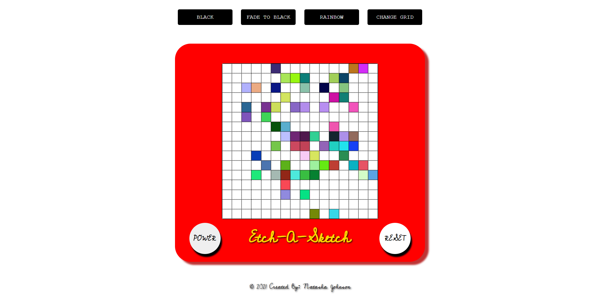

# Etch-A-Sketch

This is my solution to [Project Etch-A-Sketch](https://www.theodinproject.com/paths/foundations/courses/foundations/lessons/etch-a-sketch-project)

## Table of Contents

- [Overview](#overview)
  - [Screenshot](#screenshot)
  - [Links](#links)
- [My process](#my-process)
  - [Built with](#built-with)
  - [What I learned](#what-i-learned)
  - [Continued development](#continued-development)
- [Author](#author)

## Overview

The purpose of this project was to create a browser verion of an Etch-A-Sketch.  We were given assignment criteria as to what our project should be able to implement.  Aside from the requirements, there were also optional features that I decided to implement, as well as add more of my own.

### Screenshot

### Links

-Solution URL: [See My Code](https://github.com/artsycoder533/etch-a-sketch.git)
-Live Site URL: [See Live Site](https://artsycoder533.github.io/etch-a-sketch/)

## My Process

For this project I read the assignment criteria to make sure I fully understood the requirements.  We could only hard code the container itself in html, because the grid had to be dynamically created.  I thought about the best way to go about this and I chose to use CSS Grid.  I added a function to create the default grid and attached mouseenter event listeners to each div inside of the grid.  In the anonymous function I added black as the default "hover" color.  Next, I implementd a function to change the grid size.  The requirements stated we had to  have an alert take in input from the user, this input would be the new grid dimensions.  I them added validation to ensure the user could not enter a number less than 1 or greater than 99.  Once this was working, I then implemented the functionality for the reset button to clear the grid back to its default setting.  After that, I started working on the optional functionality to include a rainbow coloring and a rainbow coloring that progressively darkened to black with each pass of the same div.  Once these were implemented, I added an option to set the color back to black, and added a power button, to simulate the Etch-A-Sketch "turning on".  At first I was stuck on how to implement the rainbow color as well as the fade color functionality.  I originally only completed the basic requirements and decided to go back and take a deep dive into Javascript as I wasnt satisfied with my performance on this projects.  About a month later I decided to come back to this project and take what I had learned to complete the remaining tasks.  After alot of trial and error I was able to complete the project, refactor my code, and add additional functionality!

### Built With

-HTML5
-CSS3
-CSS Grid
-Javascript

### What I learned

This project combined a lot of Javascript Fundamentals primarily with Javascript fundamentals.  I learned more about DOM Manipulation such as the DOMContentLoaded event to listen for the page to load.  I also learned how to work with a node list such as accessing its style properties with the getComputedStyle method.  I learned the differece between the substr and substring method and how to make a rgb color fade to black after each pass by subtracting 10% of each individual rgb value and reformating the new color with a template string to set as the background color.  Finally, I learned more about CSS transitions and how to combine them to give the appearance of the Etch-A-Sketch turning on and off.

### Continued Development

Additional functionality I would like to add to this project is an erase button so instead of having to reset the entire grid, the user would be able to clear the color wherever they choose.
